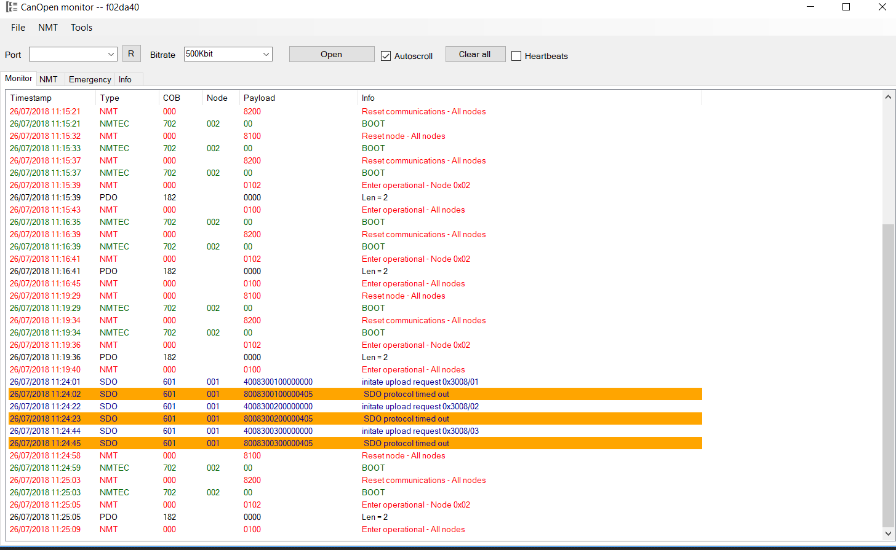
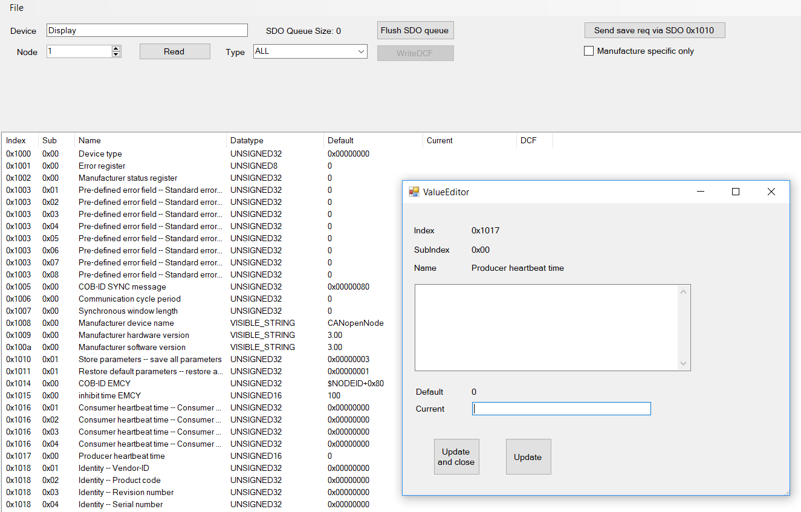

# CanOpen Monitor

    Copyright (C) 2019  Robin Cornelius
    
    This program is free software: you can redistribute it and/or modify
    it under the terms of the GNU General Public License as published by
    the Free Software Foundation, either version 3 of the License, or
    (at your option) any later version.

    This program is distributed in the hope that it will be useful,
    but WITHOUT ANY WARRANTY; without even the implied warranty of
    MERCHANTABILITY or FITNESS FOR A PARTICULAR PURPOSE.  See the
    GNU General Public License for more details.

    You should have received a copy of the GNU General Public License
    along with this program.  If not, see <http://www.gnu.org/licenses/>.

CanOpen Monitor is a C# application that can connect via a can interface and decode and log Can Open packets. Plugins are also avaliable to allow interactions with the BUS for sending NMT commands, reading and writing device object dictionaries via SDO.

Plugins can also be added for custom logging to display extra info and decoding info for any PDO or SDO transfers to provide human readable output.

# WARNING

Interacting with a live CanOpen bus may be dangerous depending on what equipment is connected. 
It may be possible to override safety protocols, or to put devices in to dangerous states. 
It is the responsibility of the user to ensure they know what they are doing. 
It is not possible for this software to offer any protection against user input as it has no knoledge of what is safe and what is not. 

This software was designed to aid working with custom CanOpenNode devices and for programmers connecting their own devices to CanOpen buses

 This program is distributed in the hope that it will be useful,
    but WITHOUT ANY WARRANTY; without even the implied warranty of
    MERCHANTABILITY or FITNESS FOR A PARTICULAR PURPOSE.  See the
    GNU General Public License for more details.

# Plugins

A number of plugins are supplied that may be useful, the plugins can send/recieve data for a number of common functions. The plugin architecture allows for the interception and injection of any CanOpen packet, specific callbacks are provided for SDO/PDO/NMT/NMTEC and other protocols. It is also possible to add entries to the main menus. And the built in plugins can be used as samples for your own.

NMTPugin - This provides the ability to send NMT commands to the bus, START/STOP/ENTER OPERATIONAL etc are all avaiable for the entire bus or for individal nodes. 

SDOEditor - This is complex plugin that also uses libEDSsharp in order to allow the loading of Electronic Data Sheets for a device, then the ability to read all the values or to write specific values back to a device. It is possible to save the current state of the device as a DCF file. DCF can also be loaded but the ability to configure a device based on DCF entries is not yet complete.

EEPROM - This gives the options to access index 0x1010 and 0x1011 to perform the SAVE/LOAD functions for saving data to persistant memory in a device. The buttons provide 2 features. One is "init eeprom" this will reset a CanOpenNode device to default EEPROM settings. very useful when you newly program a device and its reporting error with NV ram, this will default and save the data. There is also a "save" button that may prove useful with other devices where after writing to OD variables a "SAVE" will store these to eeprom.

FlashLoader - This uses the protocol from .... inorder to load a HEX file and write it to the remote device.

NanomsgBridge - This uses Nanomsg to form a IPC system so that other apps on the PC can pretend to be a complete CanOpen bus

Example - A simple plugin example with miminal functionality.

Plugins are also really useful for decoding PDO packets where its possible to decode the byte stream and display human readable values with comments as approprate. Also SDO transfers can be intercepted and messages posted to the log window to explain what they are doing.

# Drivers

CanOpenMonitor uses libcanopensimple to provide access to the can bus. This supports plugable drivers, the original ones are from CanFestival but currently only ones suitable for a CANUSB (from https://www.can232.com/?page_id=16) are present. Two versions exist for connecting via a COM port or connecting via a FDTI d2xx driver. This should also work with any other devices that use the SLCAN protocol. Not every feature is currently connected. RTR packets and extended packets are not not currently supported and timestamps from the can driver are not yet supported.

Other drivers can be added to the system and the CanFestival ones can be used as a starting point. So that other devices could be supported

# Help wanted

Linux: - The main app and libcanopensimple are c# and will work find on linux under mono. The drivers need rewriting as they are native c dlls/.so the original canfestival drivers had lots of linux examples that could be used. I do not have time for linux driver writing

Other drivers: If any one has other can hardware that interfaces to PC, i would love to get support added.

Pictures
--------

The main window shows all bus activity, color coded with protocol type and decoding from plugins shown in info column.

The SDO Editor allows live updating of paramaters in the object dictionary of any node on the bus. Load in the electronic data sheet to see avaiable objects, descriptions and their default value, then click to open the value editor which will send your new values stright to the device :-

	

